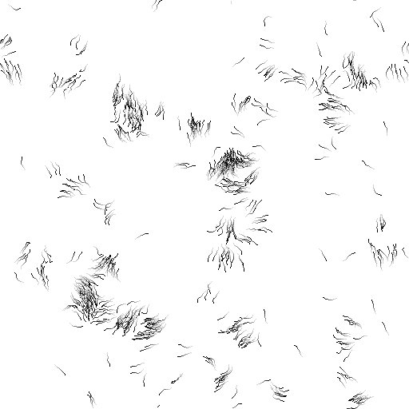
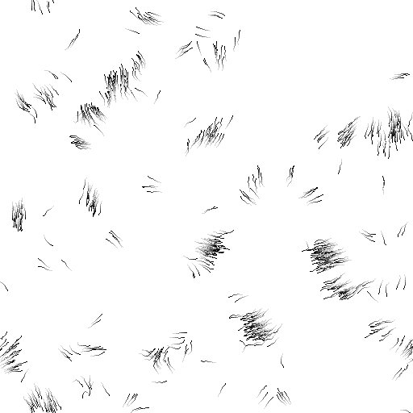
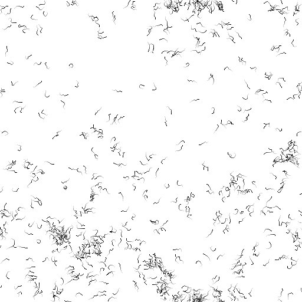
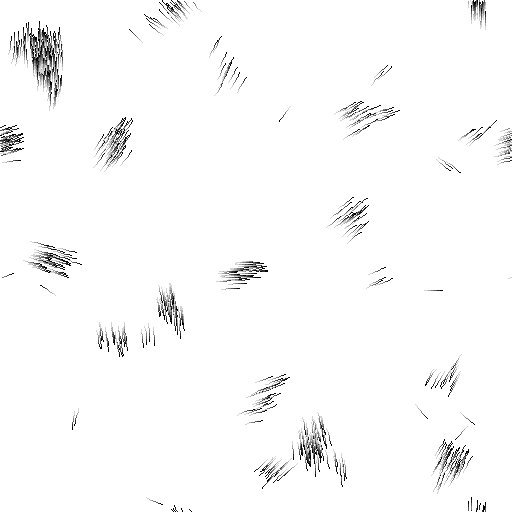

Small graphical implementation of the Vicsek model using pygame.

Features
--------
The program if fairly basic, but you can
- Add and delete birds
- Change the temperature
- Enjoy your non-equilibrium phase-transition at home

Credits
-------
Copyright (c) 2014 Romain Mueller
name dot surname at gmail dot com

Screeshots
----------
***

***

***

***

